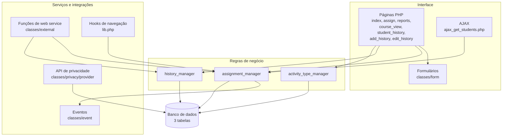

# Arquitetura — Nexo Tutoria Acadêmica (`local_studenttutor`)

## 1. Visão geral

O plugin segue a organização habitual de um plugin local do Moodle: páginas PHP na raiz, regras de
negócio em `classes/`, definições de banco em `db/`, idioma em `lang/` e testes em `tests/`.

## 2. Componentes

| Componente | Arquivos | Responsabilidade |
|---|---|---|
| Páginas | `index.php`, `assign.php`, `reports.php`, `course_view.php`, `student_history.php`, `add_history.php`, `edit_history.php`, `manage_activity_types.php`, `edit_activity_type.php` | interface, verificação de login/permissão, montagem e tratamento de formulários |
| Endpoint AJAX | `ajax_get_students.php` | lista de estudantes do curso para o autocomplete da atribuição |
| Regras de negócio | `classes/assignment_manager.php`, `classes/history_manager.php`, `classes/activity_type_manager.php` | validação, persistência, consultas, disparo de eventos |
| Formulários | `classes/form/*.php` | definição dos formulários (`moodleform`) e validação de campos |
| Web services | `classes/external/*.php` | contrato de integração (parâmetros, retornos, capability) |
| Eventos | `classes/event/assignment_created.php`, `assignment_updated.php` | trilha de auditoria no log de eventos do Moodle |
| Privacidade | `classes/privacy/provider.php` | metadados, exportação e exclusão de dados pessoais (LGPD) |
| Integração com o Moodle | `lib.php`, `settings.php` | menu "Meus Alunos" na navegação do curso, resolução de papel de tutor, configurações |
| Banco | `db/install.xml`, `db/upgrade.php`, `db/access.php`, `db/services.php` | esquema, migrações, capabilities, funções de serviço |
| Idioma | `lang/en`, `lang/pt_br` | 222 strings por idioma, em paridade |
| Testes | `tests/*` | 73 testes automatizados |
| Documentação | `README.md`, `CHANGELOG.md`, `SECURITY.md`, `PRIVACY.md`, `docs/*` | documentação técnica, funcional e legal |

## 3. Fluxos principais

### 3.1 Requisição de página (ex.: registrar atividade de tutoria)

1. `add_history.php` carrega `config.php`, exige login no curso e verifica se o usuário é tutor
   naquele curso (`local_studenttutor_is_tutor()`).
2. O formulário (`classes/form/course_history_form.php`) lista os estudantes do tutor e os tipos de
   atividade vindos de `activity_type_manager`.
3. No envio, `history_manager::add_history_entry()` valida os dados (usuários existentes, tipo de
   atividade válido, descrição não vazia) e grava o registro com autor e datas.
4. A página redireciona com notificação traduzida (`core\notification`).

### 3.2 Chamada de web service

1. O Moodle autentica o token, resolve a função e valida a capability declarada em `db/services.php`.
2. A classe em `classes/external/` valida os parâmetros (`validate_parameters`), repete a verificação
   de contexto/capability e chama o manager correspondente.
3. O manager consulta o banco via API do Moodle e o resultado é montado no formato público declarado
   em `execute_returns()`.

### 3.3 Trilha de auditoria

`assignment_manager` dispara `assignment_created` / `assignment_updated` com os identificadores de
estudante e tutor no campo `other`. Os eventos aparecem nos relatórios de log do Moodle - inclusive
em exportação para auditoria institucional - sem armazenar dado sensível.

## 4. Decisões de projeto

| Decisão | Motivo |
|---|---|
| Regras de negócio concentradas em *managers* | uma única fonte de verdade para páginas, AJAX e web services; evita divergência de validação entre telas |
| Páginas não declaram classes | classes em páginas não são autolocalizáveis nem reutilizáveis; os formulários foram movidos para `classes/form/` com namespace |
| `index.php` como lista de atribuições (sem dashboards) | dashboards duplicavam consultas e mantinham bibliotecas de gráficos de terceiros sem uso; os dados de acompanhamento são atendidos por `index.php` e `reports.php` |
| Sem cache estático em `local_studenttutor_is_tutor()` | o cache não podia ser invalidado quando as atribuições de papel mudavam e vazava estado entre testes |
| Campos de nome via `\core_user\fields::for_name()` + `username_load_fields_from_object()` | respeita a configuração de exibição de nome do site e evita avisos de campos ausentes |
| Nenhum DDL em tempo de execução | alterações de esquema acontecem apenas em `db/install.xml`/`db/upgrade.php`, conforme o padrão do Moodle |
| Sem scripts auxiliares de banco no plugin | scripts de correção avulsa foram removidos por risco de segurança; a migração usa o caminho padrão do Moodle |
| Sem exposição de mensagem interna ao usuário | mensagens de exceção e `print_r()` foram substituídos por mensagens traduzidas; depuração só em `DEBUG_DEVELOPER` |
| Colunas de e-mail removidas das consultas | o dado não era exibido em lugar nenhum; minimização de dados (LGPD) |
| Capabilities legadas mantidas | removê-las afetaria configurações de papel existentes; a decisão exige análise de impacto (registrada em `PERMISSIONS.md`) |

## 5. Padrões técnicos aplicados

- **Moodle**: `require_login`/`require_capability`, API XMLDB com *placeholders*, `sesskey` nas
  escritas, `html_writer`/`s()` na saída, `get_string()` em todo texto de interface, `moodleform`
  para formulários, eventos do Moodle para auditoria.
- **Segurança**: ver [`../SECURITY.md`](../SECURITY.md).
- **Privacidade**: API de privacidade do Moodle implementada e verificada por teste
  ([`../PRIVACY.md`](../PRIVACY.md)).
- **Estilo**: padrão oficial do Moodle, com cabeçalhos GPL e docblocks
  ([`PADROES_DE_CODIGO.md`](PADROES_DE_CODIGO.md)).
- **Testes**: PHPUnit do Moodle ([`TESTING.md`](TESTING.md)).

## 6. Pontos de extensão

- **Novos tipos de atividade**: pela interface administrativa do plugin (sem alteração de código).
- **Novos relatórios**: consultas padronizadas em `history_manager` (`get_activity_statistics()`,
  `get_history_with_details()`) podem ser reaproveitadas por novas páginas.
- **Integrações**: novas funções de web service devem seguir o padrão de `classes/external/`, com
  capability declarada em `db/services.php` e teste correspondente em `tests/external_test.php`.
- **Papéis de tutor**: ampliáveis por configuração (papel principal + papéis adicionais), sem
  alteração de código.
